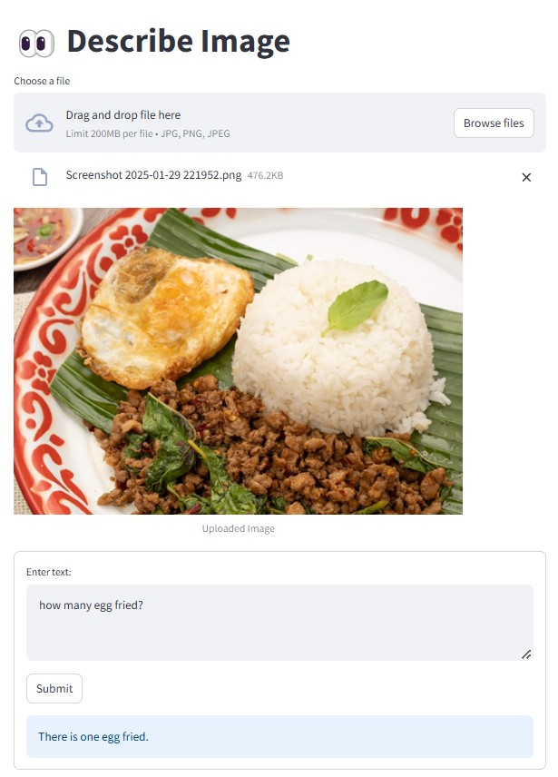

# 📸 Describe Image with Ollama

This project allows users to upload an image and generate a description using Ollama's llama3.2-vision model. The app is built using Streamlit for a simple and interactive user experience.



## 🚀 Features
* Upload an image in JPG, PNG, or JPEG format
* Send the image to Ollama's vision model
* Receive a text-based description of the uploaded image
* User-friendly Streamlit interface

## 🛠 Installation

### 1. Install Required Packages
```
pip install streamlit ollama
```

### 2. Install Ollama
Download and install [Ollama](https://ollama.com/) from the official website:

### 3. Verify Installation
Ensure Ollama is correctly installed by running:
```
ollama --version
```

## 🎯 How to Use
Run the Streamlit app with:
```
streamlit run describeimg.py
```

* Upload an Image
* Click on "Choose a file" and upload a JPG, PNG, or JPEG image.
* Enter a text query related to the image.
* Click "Submit" to receive a response from the AI model.

## 📜 License

This project is licensed under the MIT License.
